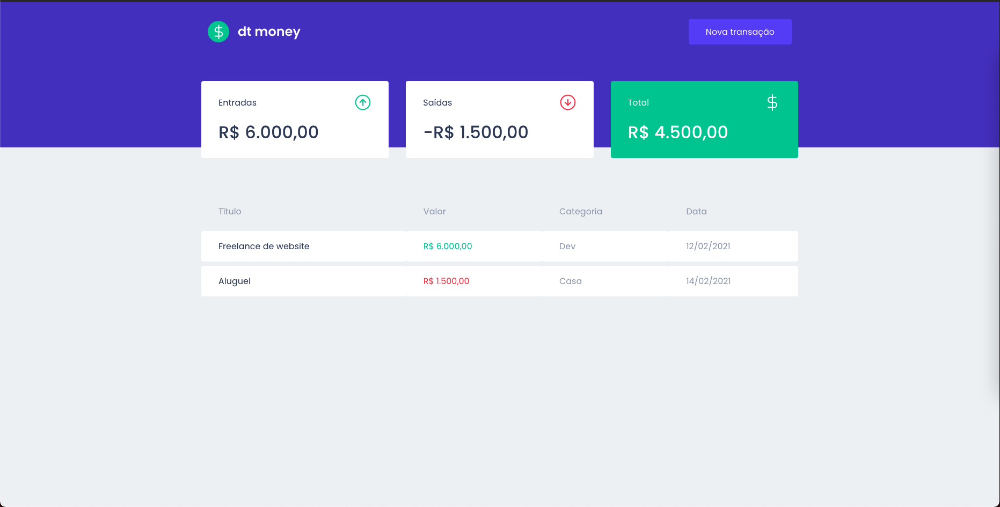

<h1 align="center">
    
</h1>

<br>

## 🧪 Tecnologias

Esse projeto foi desenvolvido com as seguintes tecnologias:

- [React](https://reactjs.org/)
- [Typescript](https://www.typescriptlang.org/)

## 🚀 Como executar

Clone o projeto e acesse a pasta do mesmo.

```bash
$ git clone https://github.com/victorb132/dt-money-ignite.git
$ cd calculator
```

Para iniciá-lo, siga os passos abaixo:
```bash
# Instalar as dependências
$ yarn

# Iniciar o projeto
$ yarn start
```

## 💻 Projeto

DT Money é um projeto para acompanhar as entradas e saídas do seu dinheiro. 

Este é um projeto desenvolvido durante o curso do Ignite by Rocket Seat.

---

Feito com 💜 by Victor Novais
